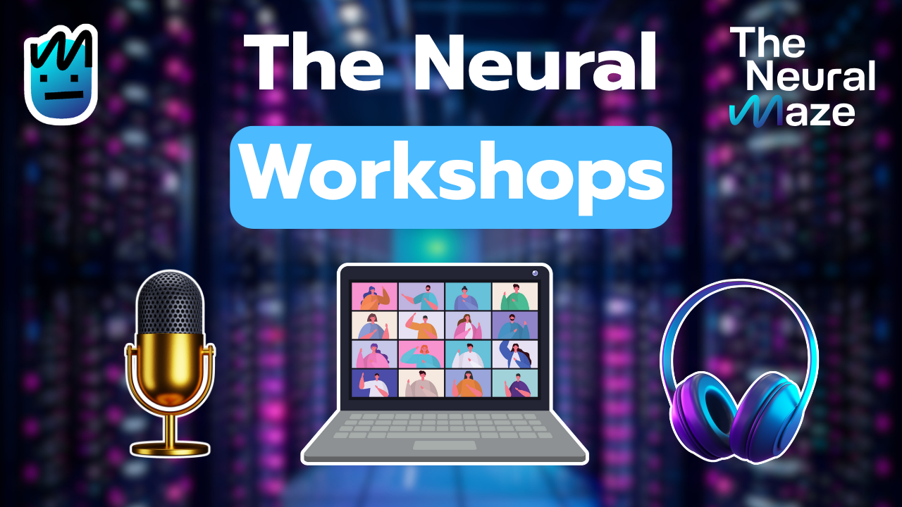

# The Neural Workshops



This repository contains materials related to workshops, talks, summits, and seminars where The Neural Maze was invited to participate. In some cases, only the presentation materials are shared, while in others, both the presentation materials and the code used during the session are included.

## 📁 Repository Structure

Navigate to the `workshops/` directory to find all available sessions, organized by event:

```
workshops/
├── aily_labs/                    # Aily Labs workshop materials
│   ├── README.md                 # Workshop description and details
│   └── PhiloAgents - Aily Labs.pdf  # Presentation slides
└── datahack_summit_2025/         # DataHack Summit 2025 materials
    ├── README.md                 # Event overview and session details
    ├── workshop/                 # Hands-on workshop materials
    └── hack_session/             # Hack session materials
```

## 🎯 How to Access Resources

### 1. **Browse by Event**
Each event has its own folder containing:
- **README.md**: Description of the event, sessions, and learning objectives
- **Presentation materials**: PDFs, slides, or documentation
- **Workshop materials**: When available, code examples and implementations, exercises, guides, etc.

### 2. **Current Available Events**

#### **Aily Labs Workshop**
- **Location**: `workshops/aily_labs/`
- **Focus**: PhiloAgents course - building AI agents that embody ancient philosophers
- **Content**: Presentation slides and workshop fundamentals covering agent systems, memory, LLMOps, and Agentic APIs

#### **DataHack Summit 2025**
- **Location**: `workshops/datahack_summit_2025/`
- **Focus**: Agentic AI with two deep-dive sessions
- **Sessions**:
  - **Workshop**: Building Intelligent Multimodal Agents (hands-on Telegram bot development)
  - **Hack Session**: Beyond PoCs - Building Real-World Agentic Systems (production strategies)

### 3. **Getting Started**
1. Choose an event that interests you from the `workshops/` directory
2. Read the event's README.md for context and prerequisites
3. Download or clone the repository to access all materials locally
4. Follow the session-specific instructions for hands-on workshops


## 📝 Contributing

If you attended one of these sessions and have additional materials, code improvements, or feedback, feel free to contribute by creating a pull request or opening an issue.
