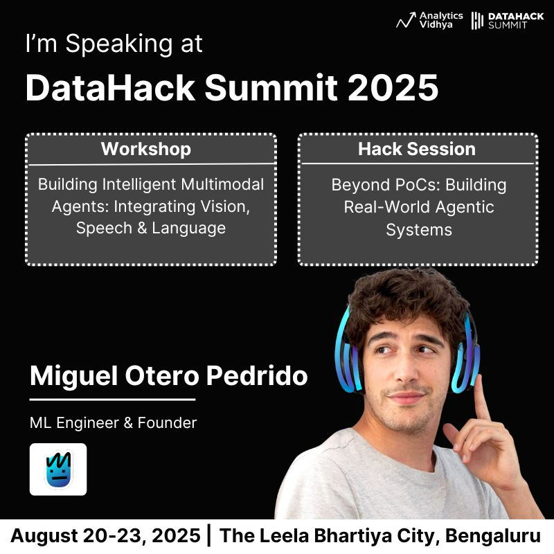

# DataHack Summit 2025

I've been invited to speak at [Analytics Vidhya's DataHack Summit 2025](https://www.analyticsvidhya.com/datahacksummit/), happening this August in Bengaluru — and I'll be running not one, but **two deep-dive sessions focused on Agentic AI**. 

> If you're into building intelligent systems that actually work in the real world, you'll want to check these out.

### [🔧 Workshop: Building Intelligent Multimodal Agents — Integrating Vision, Speech & Language](https://www.analyticsvidhya.com/datahacksummit-2025/workshops/building-a-multimodal-telegram-agent-that-sees-talks-and-thinks?utm_source=social&utm_medium=yt-community&utm_campaign=miguel)

In this hands-on workshop, we'll go beyond the buzzwords and build a fully functional multimodal Telegram agent from scratch. This isn' t just another PoC — it's for folks looking to level up and ship production-grade agentic applications.

You'll learn how to:

* Architect and deploy a multimodal agent that works on your phone

* Build and debug workflows using LangGraph and LangGraph Studio

* Store and retrieve context with SQLite (short-term) and Qdrant (long-term) memory

* Integrate Whisper for speech-to-text and ElevenLabs for text-to-speech

* Handle image inputs and outputs with LLaMA 3.2 Vision and diffusion models

* Power responses using blazing-fast Groq LLMs

* Connect it all to Telegram for a smooth, real-time experience

This is a deep dive into the full stack of agentic tech. 

**Come ready to build, test, and interact with your agent in real time!**

>💡 Prereqs: Basic Python, familiarity with LangChain or LangGraph, and a general understanding of multimodal AI.

---

### [⚔️ Hack Session: Beyond PoCs — Building Real-World Agentic Systems](https://www.analyticsvidhya.com/datahacksummit-2025/sessions/beyond-pocs-building-real-world-agentic-systems?utm_source=social&utm_medium=yt-community&utm_campaign=miguel)

This one's all about going beyond the demo. In this session, we'll explore how to design and build agentic systems that hold up in real-world environments.

What we'll cover:

* Core components of agent design: memory, tools, reasoning techniques

* How Agentic RAG improves on traditional RAG for retrieval tasks

* LLMOps strategies for taking agents into production:

* Monitoring & evaluation

* Prompt versioning

* Dataset management

* Real-time performance tracking

* Live simulation of agents operating inside a video game, applying all these ideas in action

Whether you're already building with LLMs or just diving into the world of intelligent agents, this session will give you the tools (and mindset) to make the leap from prototype to production.

---

>📍 Catch both sessions live at DataHack Summit 2025, August 20–23, at The Leela Bhartiya City, Bengaluru.

**Let’s build some agents that actually do stuff!** 
